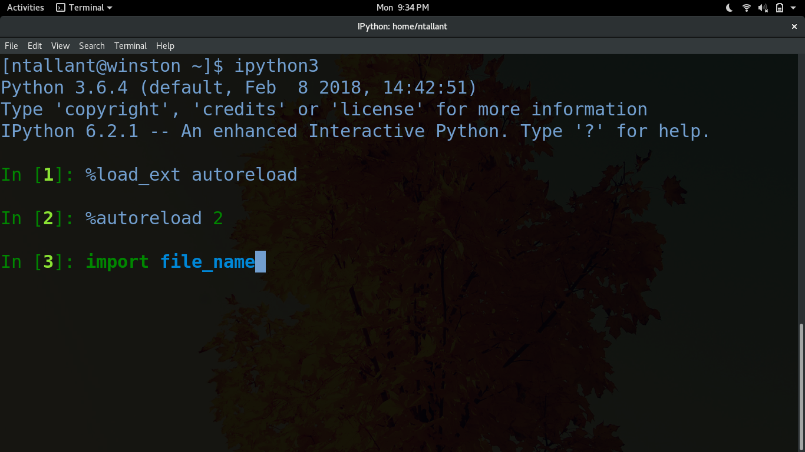

# Nick Tallant's TA Sessions
- **When &amp; Where?**
    - Mondays at 4:30 in Harris 224
- **Operating System**
    - [Fedora 27](https://getfedora.org/)
    - [UChicago VM (Ubuntu)](https://howto.cs.uchicago.edu/vm:install)
- **Text Editor**
    - [vim](https://www.vim.org/)
    - atom
- [GitHub](https://github.com/ndtallant)

If you have trouble using this repo, review this [GitHub tutorial](https://help.github.com/articles/fetching-a-remote/) on clone, fetch, merge, and pull.

## 1 - Shell Scripting
This lab was meant to familiarize students with navigating the terminal and using shell commands. Things to remember:
- The important ones: cd, ls, mkdir, rm, cp, mv
- Some useful ones: wc, grep, curl
- An example of Regular Expressions
- Workflow with a text editor and interpreter/Shell

## 2 - Python Basics
This lab covers:
- Doc Strings
- Working with functions
- Returning multiple values with functions
- Returning no values with functions
- Global variables
- A first look at some data structures
- Using iPython
    - Specifically autoreload


Code snippets:

```
my_variable = input('Text will show up here')
```

## 3 - Data Structures
A brief review on data structures, including:
- pointers
- iterating
- indexing
- lists
- dictionaries
    - keys, values, items
- tuples
- sets

Example output of a row for `read_salaries()`:

Row from csv :

`"AARON,  JEFFERY M",SERGEANT,POLICE,F,Salary,,$101442.00,`

Row in output:

`['AARON', 'JEFFERY', 'SERGEANT', 'POLICE', 'F', 'Salary', '', 101442.0, '']`

## 4 - Putting it Together
See Media.ipynb for objectives!
